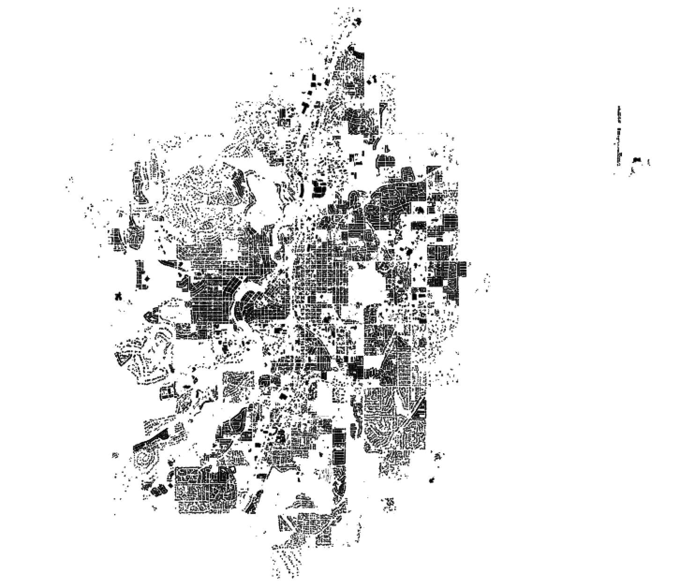

# Bend Building Import Project

This repo acts as a workspace for doing a bulk import of the 2004 building footprints from the City of Bend. Inspired in part by the [excellent job done by the Los Angeles maptime folks](https://github.com/osmlab/labuildings).

## Purpose

Currently only a handful of buildings are available in OpenStreetMap for Bend. While the city's dataset is 12 years old as of 2016, there are still 36,213 features in the dataset, most of which are probably still there. Although thousands of buildings will be missing, this will be a great start!

## Steps

[x] Acquire city data

[x] Create import [wiki page](https://wiki.openstreetmap.org/wiki/Bend_building_import)
 - The wiki page also needs to be maintained throughout the project

[x] Determine attributes to be imported (discuss in [this issue](https://github.com/MaptimeBend/bend_buildings/issues/1))

[x] Acquire any additional data needed

[ ] Process data

[ ] Get "buy in" from OSM community

[ ] Prepare import: [OSM wiki page on imports](http://wiki.openstreetmap.org/wiki/Import/Guidelines)

[ ] Decide on how to divide import tasks

[ ] Execute import

## Additional info

Path to DOGAMI LiDAR:  ftp://coast.noaa.gov/pub/DigitalCoast/lidar1_z/geoid12a/data/1452/ or https://coast.noaa.gov/htdata/lidar1_z/geoid12a/data/1452/

LiDAR Tutorial on Generating Building Footprint: http://www.developmentseed.org/blog/2014/08/07/processing-lidar-point-cloud/

PDAL tutorials: http://www.pdal.io/workshop/exercises/analysis/ground/ground.html#ground
